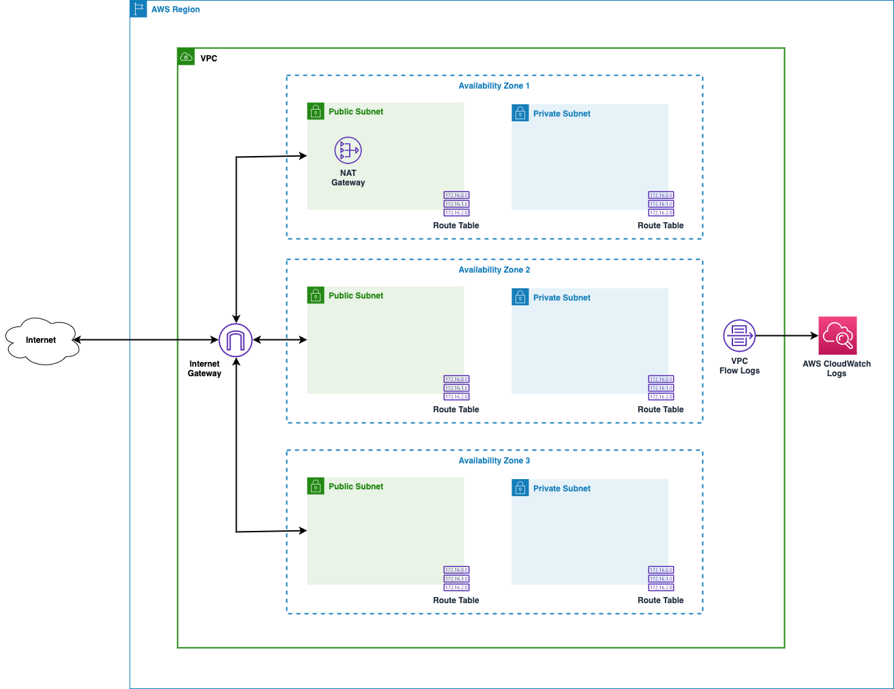

# AWS CloudFormation Template - Multi-tier VPC

This CloudFormation template configures a multi-tier VPC based on a set of input parameters. It's meant to act as a starting point for you to begin managing VPCs and related resources using Infrastructure as Code (IaC).

## Default Topology

Although the following diagram shows the default topology, you can use the parameters explained below to change the configuration.



## Features

This template currently supports:

* A maximum of three tiers. e.g. public, private, and restricted.
* Tiers are optional. For example, you may need only public and private tiers in a VPC.
* 1 to 3 Availability Zones (AZs) are supported. 
* All tiers have the same number of AZs.
* When both public and private subnets are specified, you can optionally request that a NAT Gateway be provisioned.
  * When a NAT Gateway is specified, you can either specify a single NAT Gateway in the first public subnet or you can specify that a NAT Gateway be provisioned in each public subnet and therefore in each AZ.

* VPC Flow Logs are configured by default.
* Wherever supported, resources are assigned names based on the `pOrg`, `pSystem`, `pVpcName` parameters.

This template does not currently configure VPC endpoints, but PRs are welcome.

## Usage

Create an AWS CloudFormation stack based on the parameters described in the next section and the template [`vpc-multi-tier.yml`](vpc-multi-tier.yml)

## Parameters

## Common Parameters

Use the following parameters to assign the overall CIDR block for the VPC, specify the number of AZs to create across each of the required tiers, and whether Internet and NAT Gateways should be provisioned.

|Parameter|Required|Description|Default|
|---------|--------|-----------|-------|
|`pVpcName`|Optional|Acts as the qualifier of the VPC name and is also used to qualify supporting resource names per AWS resource naming best practices.|`dev` is the default qualifier value and is prefixed by the value of `pSystem` to create the VPC name. For example, with default parameter values for `pSystem` and `pVpcName`, the VPC name will be `infra-dev`.|
|`pOrg`|Optional|Used to qualify IAM resource names per AWS resource naming best practices.|`example`|
|`pSystem`|Optional|Used to qualify IAM resource names per AWS naming best practices.|`infra`|
|`pCidr`|Required|CIDR block of the VPC|`10.1.0.0/20`|
|`pNumAzs`|Optional|`1`, `2` or `3`. Number of Availability Zones (AZs) required for each of tier. Drives the number of subnets to create in each tier.|`2`|
|`pCreateInternetGateway`|Optional|`true` or `false`. Create Internet Gateway for the VPC|`true`|
|`pCreateNatGateways`|Optional|`true` or `false`. Create one or more  NAT Gateways and configure the private and restricted subnets to route Internet bound traffic to the NAT Gateways. By default, a NAT Gateway is created in each public subnet.|`true`|
|`pCreateSingleNatGateway`|Optional|`true` or `false`. Create a single NAT Gateway in the first public subnet and configure routing in other subnets to route Internet bound traffic to the single NAT gateway.|`true`|
|`pPermissionsBoundaryArn`|Optional|AWS IAM Permissions Boundary ARN||

### Tier Parameters

Depending on the number of tiers required, you will need to provide the following data:

|Parameter|Required|Description|Default|
|---------|--------|-----------|-------|
|`pTier1Create`|Optional|`true` or `false`. Whether or not a tier 1 set of subnets should be created.|`true`|
|`pTier1Name`|Optional|Name of tier 1. Used to qualify subnet names.|`public`|
|`pTier2Create`|Optional|`true` or `false`. Whether or not a tier 2 set of subnets should be created.|`true`|
|`pTier2Name`|Optional|Name of tier 2. Used to qualify subnet names.|`private`|
|`pTier3Create`|Optional|`true` or `false`. Whether or not a tier 3 set of subnets should be created.|`false`|
|`pTier3Name`|Optional|Name of tier 3. Used to qualify subnet names.|`restricted`|

### Subnet Parameters

Depending on the number of tiers and AZs, you will need to provide the following CIDR data:

|Parameter|Required|Description|Default|
|---------|--------|-----------|-------|
|`pTier1Subnet1Cidr`|Optional|CIDR block for Tier 1, Subnet 1. Required if creating Tier 1.|`10.1.0.0/24`|
|`pTier1Subnet2Cidr`|Optional|CIDR block for Tier 1, Subnet 2. Required if creating Tier 1.|`10.1.1.0/24`|
|`pTier1Subnet3Cidr`|Optional|CIDR block for Tier 1, Subnet 3. Required if creating Tier 1 and 3 AZs.|`10.1.2.0/24`|
|`pTier2Subnet1Cidr`|Optional|CIDR block for Tier 2, Subnet 1. Required if creating Tier 2.|`10.1.3.0/24`|
|`pTier2Subnet2Cidr`|Optional|CIDR block for Tier 2, Subnet 2. Required if creating Tier 2.|`10.1.4.0/24`|
|`pTier2Subnet3Cidr`|Optional|CIDR block for Tier 2, Subnet 3. Required if creating Tier 2 and 3 AZs.|`10.1.5.0/24`|
|`pTier3Subnet1Cidr`|Optional|CIDR block for Tier 3, Subnet 1. Required if creating Tier 3.|`10.1.6.0/24`|
|`pTier3Subnet2Cidr`|Optional|CIDR block for Tier 3, Subnet 2. Required if creating Tier 3.|`10.1.7.0/24`|
|`pTier3Subnet3Cidr`|Optional|CIDR block for Tier 3, Subnet 3. Required if creating Tier 3 and 3 AZs.|`10.1.8.0/24`|

## Exported CloudFormation Stack Outputs

The following CloudFormation stack outputs are exported so that other stacks can import this data:

* `${AWS::StackName}::vpc-id`

* `${AWS::StackName}::${pTier1Name}-subnet-id-1`
* `${AWS::StackName}::${pTier1Name}-subnet-id-2`
* `${AWS::StackName}::${pTier1Name}-subnet-id-3`

* `${AWS::StackName}::${pTier2Name}-subnet-id-1`
* `${AWS::StackName}::${pTier2Name}-subnet-id-2`
* `${AWS::StackName}::${pTier2Name}-subnet-id-3`

* `${AWS::StackName}::${pTier3Name}-subnet-id-1`
* `${AWS::StackName}::${pTier3Name}-subnet-id-2`
* `${AWS::StackName}::${pTier3Name}-subnet-id-3`

Application workload CloudFormation templates can import these values so that they can easily obtain the associated VPC ID and subnet IDs. For example:

```
 Fn::ImportValue: !Sub '${pVpcStackName}::public-subnet-id-1' 
 ```
